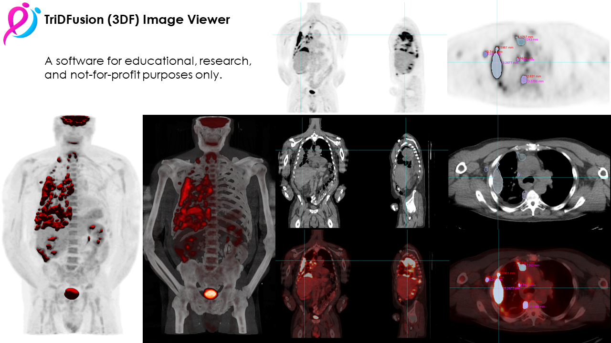

<div align="center">
  <h1>TriDFusion (3DF) Image Viewer</h1>
<p><strong>The TriDFusion (3DF) Image Viewer</strong> is a multi-fusion image viewer for research, developed at <a href="https://www.mskcc.org/">Memorial Sloan Kettering Cancer Center</a> and provided by <a href="https://daniellafontaine.com/">Daniel Lafontaine</a>, published by <a href="https://ejnmmiphys.springeropen.com/articles/10.1186/s40658-022-00501-y">EJNMMI Physics</a>. Full-text access is available for download <a href="https://rdcu.be/cXP9i/">here</a>.</p>
</div>
  
  
[](https://github.com/dicomtools/TriDFusion)
[](https://github.com/dicomtools/TriDFusion/blob/main/LICENSE)



## File format compatibility

| Medical Imaging Modalities                 | Import / Export File Formats                         |
| ------------------------------------------ | ---------------------------------------------------- |
| Positron Emission Tomography PET-CT (PT)   | DICOM using custom/vendor dictionaries               |
| Gamma Camera, Nuclear Medicine (NM)        | Raw data from nuclear imaging devices                |
| Computed Tomography (CT)                   | DICOM-RT structure (contours)                        |
| Digital Radiography (CR, DX)               | CERR planC, dose volumes and constraints             |
| Digital Angiography (XA)                   | Comma Separated Values (.csv)                        |
| Magnetic Resonance (MR)                    | Standard Triangle Language (.stl)                    |
| Secondary Pictures and Scanned Images (SC) | Audio Video Interleave (.avi)                        |
| Mammography (MG)                           | Moving Pictures Expert Group 4 (.mp4)                |
| Ultrasonography (US) 						 | Graphics Interchange Format (.gif)                   |
|											 | Digital Imaging and Communications (.dcm)            |
|											 | Joint Photographic Experts Group (.jpg)              |
|											 | Bitmap (.bmp)                                        |
|											 | Portable Network Graphics (.png)                     |
|                                            | Neuroimaging Informatics Technology Initiative (.nii)|
|                                            | Nearly Raw Raster Data (.nrrd)                       |

## Main features
- Multi-modality Image Viewer
- Total Tumor Burden Determination
- 3D Visualization
- 3D Printing
- Image Multi-Fusion
- Image Convolution
- Image Registration
- Image Resampling
- Image Re-Orientation
- Image Arithmetic and Post Filtering
- Image Editing
- Image Mask
- Image Constraint
- Lung Segmentation
- Edge Detection
- Voxel Dosimetry
- Machine Learning Segmentation
- Machine Learning 3D Lung Shunt & Lung Dose
- Machine Learning 3D Lung Lobe Quantification
- Machine Learning Y90 Dosimetry
- Radiomics

## MATLAB tested version

* MATLAB 2024a
* MATLAB 2025a

## Installation

https://github.com/dicomtools/TriDFusion/wiki/Source-code-version-of-TriDFusion-(3DF)

The source code of TriDFusion (3DF) is distributed on gitHub. Hence, the first step is to download the "main" branch of TriDFusion (3DF). This can be done using the git bash. After going to the directory where you want to download the files, use the following command to download the "main" branch of TriDFusion (3DF): 

git clone https://github.com/dicomtools/TriDFusion.git

After downloading the "main" branch to (say) /home/.../.../TriDFusion_from_gitHub/, follow the steps listed below to use TriDFusion (3DF).

Fire up Matlab. Go to Home --> Set Path. Set the path to "Default". Add /home/.../.../TriDFusion_from_gitHub/ with sub-directories to the Matlab path.

To use TriDFusion (3DF) Graphical User Interface, type TriDFusion() in Matlab command window.

## Usage

MATLAB command:

	Note: Option settings must fit on one line and can contain at most one semicolon.
	-3d    : Display 2D View using 3D engine.
	-b     : Display 2D Border.
	-i     : TriDFusion is integrated with DIDOM Database Browser.
	-fusion: Activate the fusion. *Requires 2 volumes.
	-mip   : Activate the 3D MIP. *The order of activation of the MIP, vol, and iso dictates the emphasis of each feature of the 3D resulting image.
	-vol   : Activate the 3D volume rendering. *The order of activation of the MIP, vol, and iso dictates the emphasis of each feature of the 3D resulting image.
	-iso   : Activate the 3D iso surface. *The order of activation of the MIP, vol, and iso dictates the emphasis of each feature of the 3D resulting image.
	-w name: Execute a workflow.
	-r path: Set a destination path. 

	Example:
	TriDFusion(); Open the graphical user interface.
	TriDFusion('path_to_dicom_series_folder'); Open the graphical user interface with a DICOM image.
	TriDFusion('path_to_dicom_series_folder_1', 'path_to_dicom_series_folder_2');  Open the graphical user interface with 2 DICOM images.
	TriDFusion('path_to_dicom_series_folder_1', 'path_to_dicom_series_folder_2', '-fusion'); Open the graphical user interface with 2 DICOM images and fuse them.
	TriDFusion('path_to_dicom_series_folder', '-mip'); Open the graphical user interface with a DICOM image and create a 3D MIP.
	TriDFusion('path_to_dicom_series_folder', '-iso'); Open the graphical user interface with a DICOM image and create a 3D iso surface model.
	TriDFusion('path_to_dicom_series_folder', '-vol'); Open the graphical user interface with a DICOM image and create a 3D volume rendering.
	TriDFusion('path_to_dicom_series_folder', '-mip', '-iso', '-vol'); Open the graphical user interface with a DICOM image and create a fusion of a 3D MIP, iso surface, and volume rendering. Any combination can be used. 
	TriDFusion('path_to_dicom_series_folder', '-w', 'workflow_name'); Open the graphical user interface with a DICOM image and execute a workflow. Refer to processWorkflow.m for a list of all available workflows. Refer to dicomViewer.m for workflows the default values.

DICOM directory structure:


    |-- main folder                             <-- The main folder or all series  

    |      |-- parent folder (series folder 1)  <-- Individual series folder 1
    |      |-- parent folder (series folder N)  <-- Individual series folder N
	
## Optional Modules

CERR 
https://github.com/cerr/CERR

### Machine Learning Segmentation
TotalSegmentator 
https://github.com/wasserth/TotalSegmentator

After installation, open a command prompt and run `where TotalSegmentator`. If it doesn’t return a path, add the TotalSegmentator installation path to the Windows environment variables.

### Radiomics
PY-Radiomics 
https://pyradiomics.readthedocs.io/en/latest/installation.html

After installation, open a command prompt and run `where pyRadiomics`. If it doesn’t return a path, add the pyRadiomics installation path to the Windows environment variables.

### Monte Carlo particle transport engines 
PHITS  (Tested version: 330A)
https://phits.jaea.go.jp/rirekie.html

Required Python Module Installation Instructions

	TriDFusion will execute the Python scripts TriDFusion\kernel\Dose_Simulation_Controller.py, PHITS_DoseEngine.py, LED_DoseEngine.py and ICRP107_RadionuclideData.py. Please ensure that all required modules are installed. You can install them using the following commands:

    numpy: Execute the command pip install numpy to install the NumPy library, which is essential for numerical computations.

    nrrd: Install the nrrd library, used for reading and writing NRRD files, by running pip install pynrrd.

    Other Dependencies: Make sure you have the following standard Python modules installed:
        sys: No installation required as it's part of the Python standard library.
        math: No installation required as it's part of the Python standard library.
        os: No installation required as it's part of the Python standard library.
        shutil: No installation required as it's part of the Python standard library.
        subprocess: No installation required as it's part of the Python standard library.
        argparse: No installation required as it's part of the Python standard library.
		
After installation, open a command prompt and run `where phits`. If it doesn’t return a path, add the phits installation path (typically C:\phits\bin\) to the Windows environment variables.

## References 

If you use TriDFusion (3DF) please cite it
https://ejnmmiphys.springeropen.com/articles/10.1186/s40658-022-00501-y
```
Lafontaine D, Schmidtlein CR, Kirov A, Reddy RP, Krebs S, Schöder H, Humm JL. TriDFusion (3DF) image viewer. EJNMMI Phys. 2022 Oct 18;9(1):72. doi: 10.1186/s40658-022-00501-y. PMID: 36258098; PMCID: PMC9579267.
```

Visit https://daniellafontaine.com/ for more information.